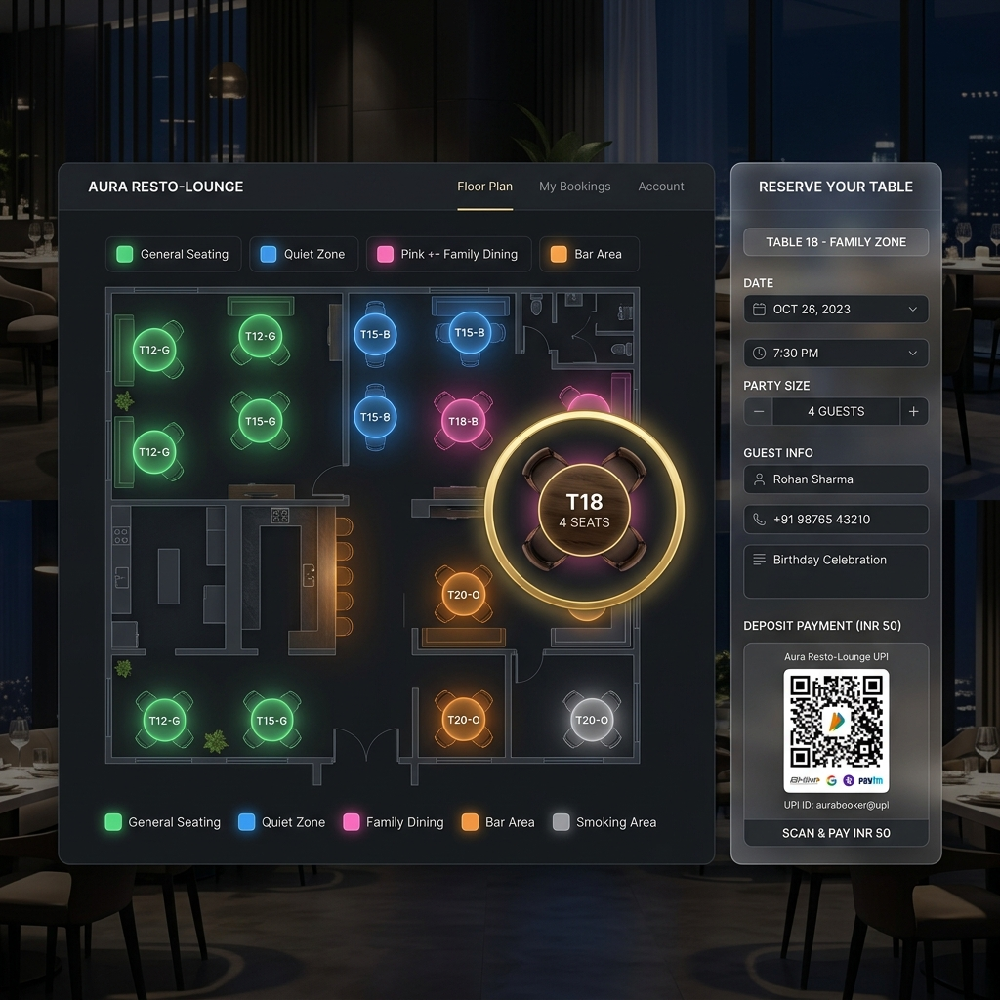
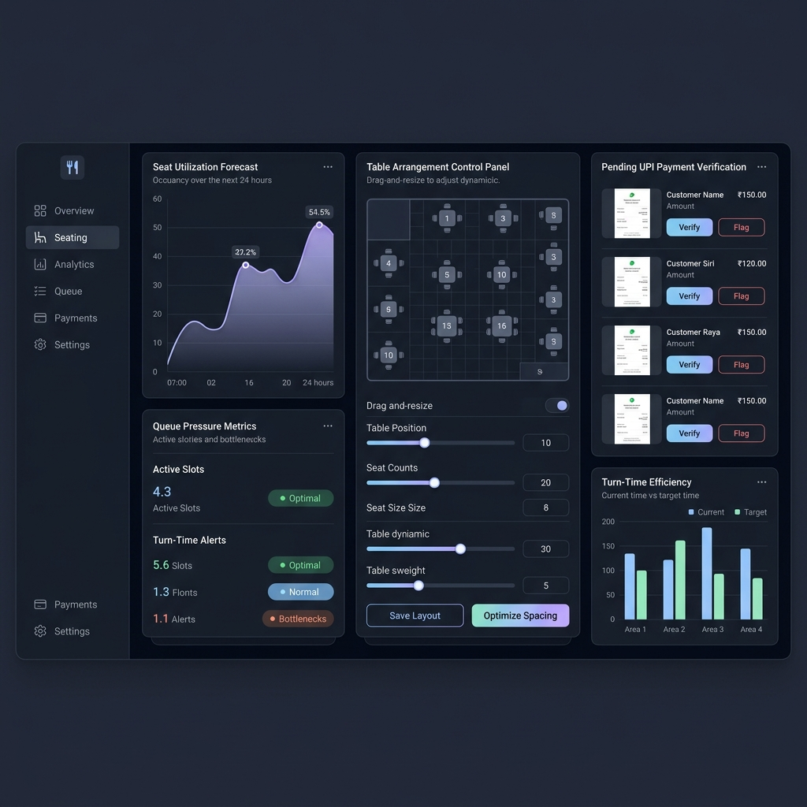
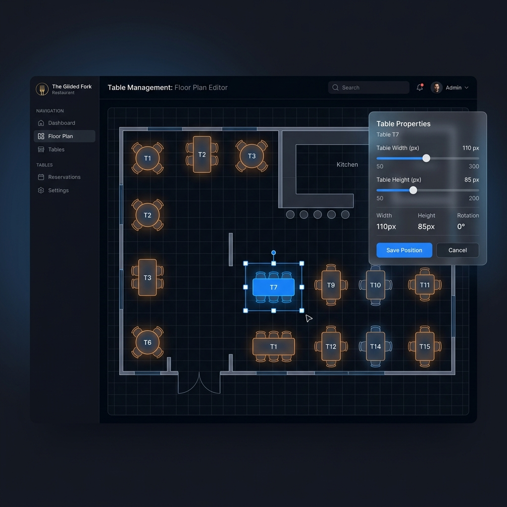
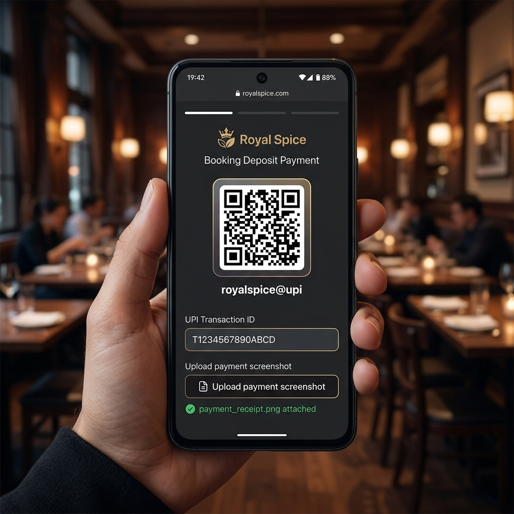
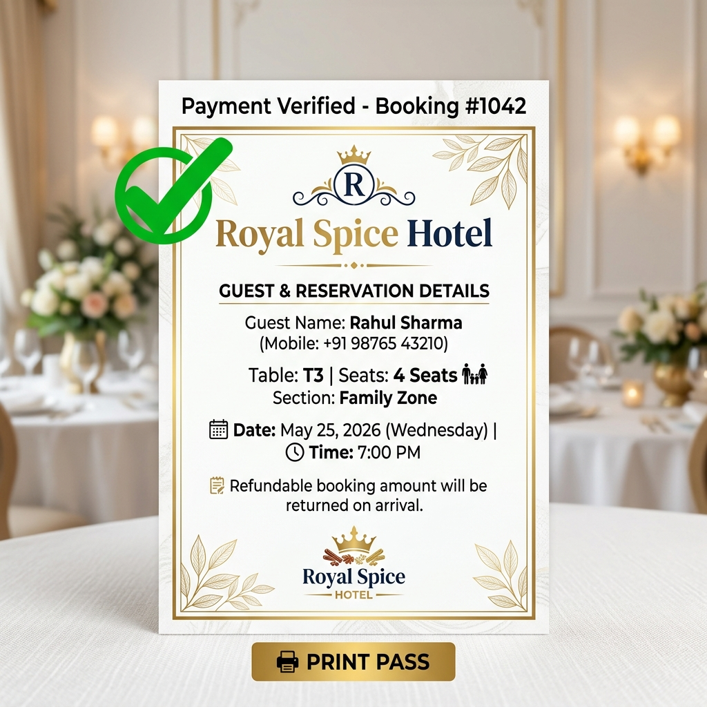
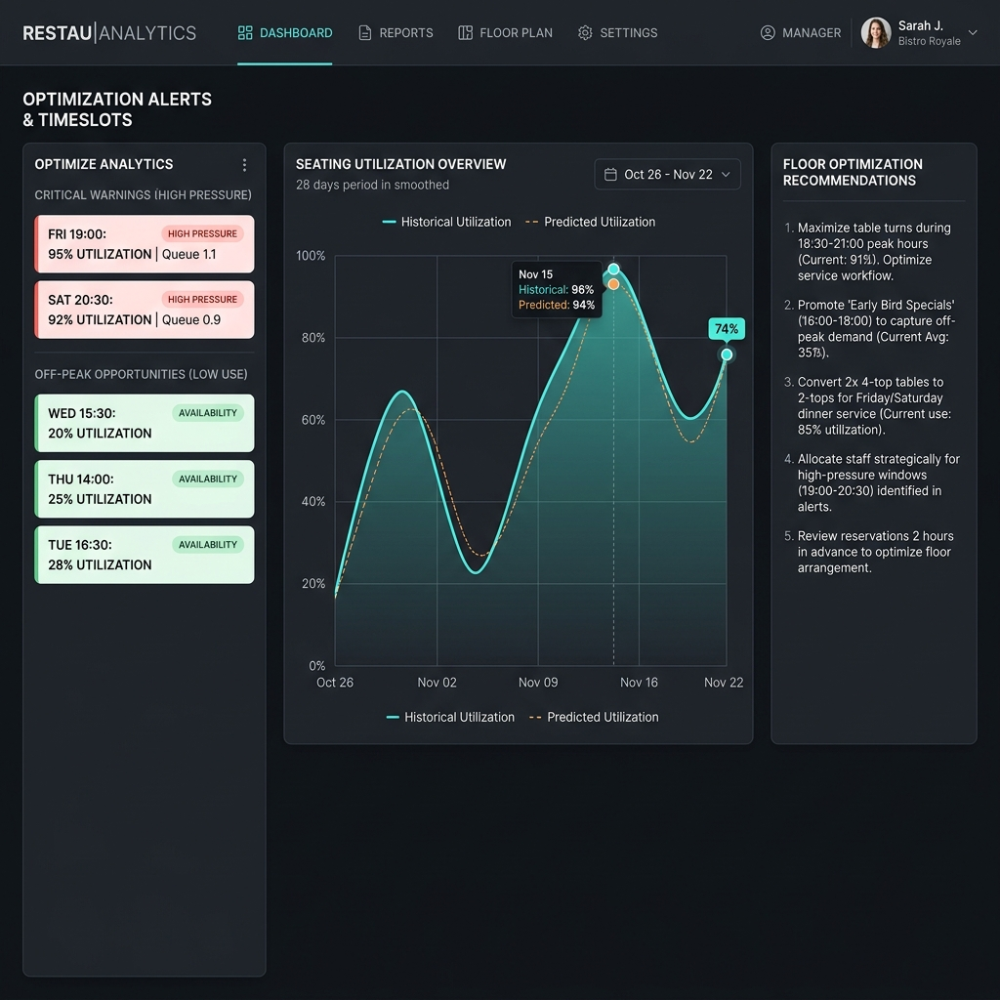
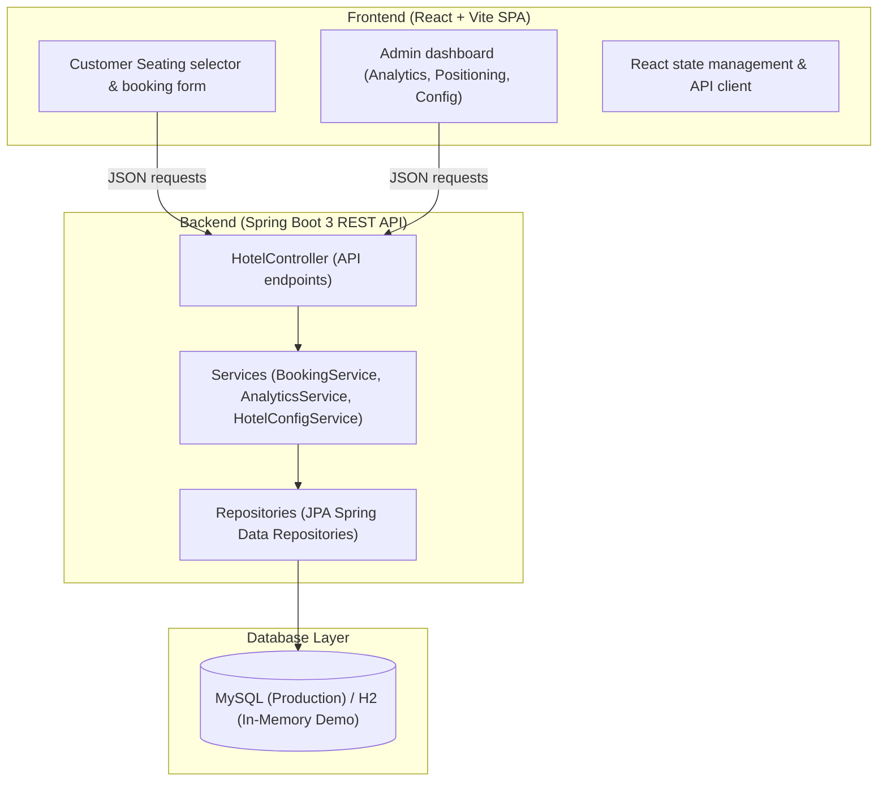
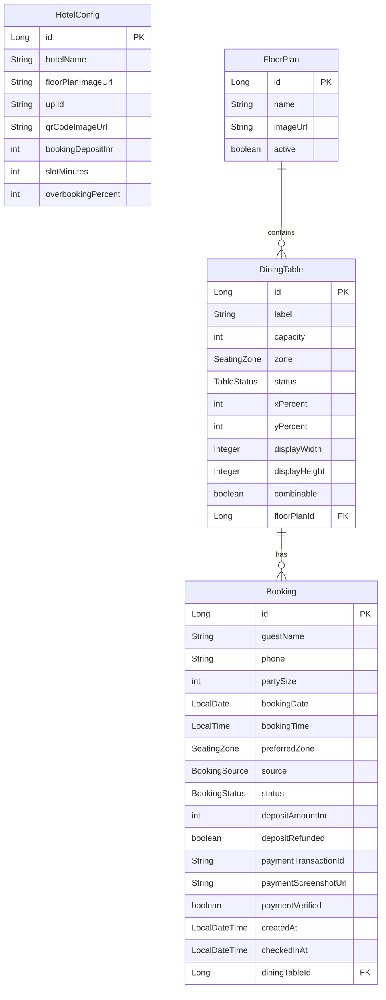
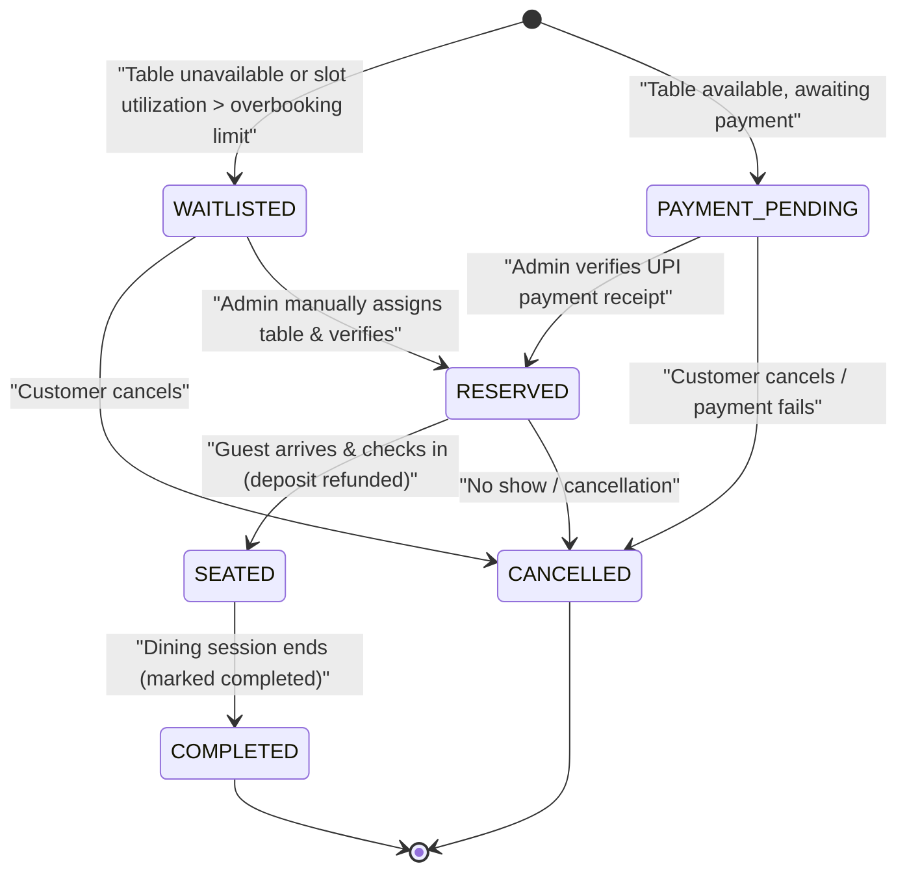

# 🏨 Hotel Seating Intelligence

[](https://spring.io/projects/spring-boot)
[](https://react.dev/)
[](https://www.mysql.com/)
[](https://deepmind.google/)

An intelligent, full-stack floor-plan reservation, payment verification, and seat allocation system. Designed to bridge real-world physical layouts with automated analytics, this application assists restaurants and hotels in maximizing table utilization, predicting occupancy, managing offline/online booking synchronizations, and reducing booking attrition via deposit checks.

---

## 📸 Interactive Visual Showcase

Below are the detailed visual representations describing every key feature of the Hotel Seating Intelligence application.

### 1. Customer Seating Selector
Customers view a real image of the restaurant floor layout and click directly on glowing, color-coded tables mapping to their preferred zone.


### 2. Admin Operations Command Center
Admins track live seating metrics, view current and predicted utilization, review pending transactions, and check queueing alerts.


### 3. Interactive Table Positioning Tool
Admins can select any table and position it on the floor layout overlay with a single click, or resize width and height with real-time sliders.


### 4. Attrition-Proof UPI QR Code Payment Form
Ensures reservations are genuine by capturing a small deposit using QR code payments, requiring the transaction ID and receipt screenshot.


### 5. Verified Customer Welcome Pass
Upon payment validation, a formal greeting pass is generated for the customer to print or save. This pass is scanned at check-in to process their deposit refund.


### 6. Occupancy Forecasting & Queue Analytics
A rolling 28-day moving average projects occupancy, while queueing metrics alert managers to operational bottlenecks during peak times.


---

## 🌟 Core Features & Workflows

### 🛋️ For Customers (Layman-friendly Flow)
1. **Interactive Floor Maps**: Instead of filling a blind form, customers view a real image of the restaurant layout (e.g. Ground Floor, Terrace) and click on their desired table.
2. **Seat Color Coding**: Customers easily filter tables by zones (`Family`, `General`, `Smoking`, `Bar`, `Outdoor`, `Private`) and see which tables are already occupied.
3. **Attrition-Proof UPI Deposit**: To prevent fake reservations, a refundable booking fee (e.g., `50 INR`) is collected. Customers scan the hotel's UPI QR Code, input their Transaction ID, upload a payment screenshot, and submit.
4. **Printable Welcome Pass**: Once the admin verifies the payment proof, a printable confirmation card containing the reservation details is generated, which the customer prints or saves to show at the reception.

### ⚙️ For Admin (Operations & Intelligence)
1. **White-Label Branding**: Admins can customize the hotel name globally, altering the page header, footer, and the browser document title dynamically.
2. **Coordinate-based Seating Setup**: Drag-and-drop table positions by choosing a table and clicking the exact position on the floor map. Set custom table shapes and dimensions using simple width and height sliders.
3. **Auto-Seating Generator**: If no custom floor layout exists, admins can generate a clean, balanced grid layout of tables of various sizes.
4. **UPI Proof Review**: Dashboard presents pending transaction tickets side-by-side with user-uploaded screenshots. A single click verifies the booking and updates the table status.
5. **Smart Waitlisting**: Auto-waitlists bookings during high-load periods or when overbooking thresholds are crossed.
6. **Queueing-Theory Diagnostics**: Analyzes incoming customer load against service capacity to provide operational suggestions (e.g., "High queue pressure. Increase turn-time attention").
7. **Moving-Average Occupancy Forecasting**: Forecasts seat demand based on a rolling 28-day historical booking window.

---

## 🏗️ High-Level Design (HLD)

The system follows a classic decoupled 3-tier architecture containing a Single Page Application (SPA) frontend, a RESTful API backend, and a relational database.

### Architectural Diagram


### Component Flow Description
1. **Presentation (React)**: Fetches the active configuration, active floor plans, and table layout. Renders the SVG-like absolute positioning overlays on top of floor layouts. Renders admin forms, charts, and metrics.
2. **Application (Spring Boot)**: Receives HTTP requests, executes business validation (e.g., verifying party size fits the table capacity), checks overbooking rules, manages table coordinate states, and handles transaction status.
3. **Data & Persistence**: Hibernate maps objects to database schemas. H2 DB profile operates fully in-memory for testing, while MySQL stores persistent configs, floors, tables, and bookings in production.

---

## 📐 Low-Level Design (LLD)

### Database Schema (Entity Relationships)
The data model consists of four principal entities: `HotelConfig`, `FloorPlan`, `DiningTable`, and `Booking`.



### Booking State Machine
Bookings progress through strict states to maintain queue sanity and payment transparency.



---

## 🧮 Core Algorithms & Calculations

### 1. Availability & Table Recommendation
When a customer queries availability for a specific party size and zone, the engine performs the following checks:
* Loads active bookings for the designated `bookingDate` and `bookingTime`.
* Excludes tables mapped to these active bookings.
* Filters the remaining tables where `capacity >= partySize` and `status != TableStatus.BLOCKED`.
* Filters by selected `SeatingZone` (if provided).
* Sorts available tables in ascending order of capacity (minimizing seat wastage) and returns the top 6 recommendations.

### 2. Queue Pressure Formula
Queue pressure is used to monitor traffic density and alert staff if wait times are expected to rise.
$$\text{Traffic Intensity} = \frac{\text{Active Bookings}}{\text{Total Available Tables}}$$
$$\text{Queue Pressure} = \min\left(1.5, \frac{\text{Traffic Intensity} + \frac{\text{Reserved Seats}}{\text{Total Seats}}}{2}\right)$$
* **Pressure > 0.8** alerts admins to accelerate turn-times and stop allocating Smoking or Bar zones to families.

### 3. Utilization Forecasting
To compute predicted utilization for a given date, the system queries booking history for the preceding 28 days:
$$\text{Average Seats Filled} = \frac{\sum \text{Occupied Seats on Day } d}{28}$$
$$\text{Predicted Utilization \%} = \frac{\text{Average Seats Filled}}{\text{Total Table Capacity}} \times 100$$

### 4. Overbooking Decision Matrix
To protect customer satisfaction, the system limits how many bookings can be confirmed for a time slot:
$$\text{Overbooking Limit} = \text{Total Seats} + \left( \text{Total Seats} \times \frac{\text{Overbooking \% Config}}{100} \right)$$
* If the incoming booking pushes `reservedSeats + partySize` past this limit, the system forces the booking status to `WAITLISTED` rather than `PAYMENT_PENDING`, warning the customer beforehand.

---

## 🔌 API Specification

### Configuration APIs
* **`GET /api/config`**: Fetches global config settings (hotel name, UPI details, QR image, deposit fee).
* **`PUT /api/config`**: Updates configuration settings.

### Table & Floor Mapping APIs
* **`GET /api/floors`**: Lists all floor plans.
* **`POST /api/floors`**: Creates a floor plan.
* **`PUT /api/floors/{id}`**: Updates floor name/image.
* **`GET /api/tables?floorId={id}`**: Retrieves tables for a floor.
* **`POST /api/tables`**: Registers a new table.
* **`PUT /api/tables/{id}`**: Updates a table (its labels, capacity, coordinates, dimensions).
* **`DELETE /api/tables/{id}`**: Blocks/removes a table.
* **`POST /api/floors/{id}/generate-layout`**: Generates a standard grid layout for a floor.

### Booking & Query APIs
* **`GET /api/availability`**: Checks open tables for a date, time, and party size.
  * **Parameters**: `date` (YYYY-MM-DD), `time` (HH:MM), `partySize` (int), `zone` (optional), `floorId` (optional).
* **`GET /api/bookings?date={date}`**: Lists bookings for a selected date.
* **`POST /api/bookings`**: Submits a booking (requires screenshot, TXN ID, and table).
* **`POST /api/bookings/{id}/verify-payment`**: Marks deposit as verified and moves status to `RESERVED`.
* **`POST /api/bookings/{id}/check-in`**: Marks guest as seated, releases table coordinates, and refunds deposit.
* **`POST /api/bookings/{id}/cancel`**: Cancels reservation.
* **`GET /api/dashboard?date={date}`**: Retrieves occupancy analytics, slot insights, recommendations, and zone counts.

---

## 🚀 Installation & Local Setup

### Backend (Spring Boot)
1. **Prerequisites**: Ensure Java JDK 17+ and Maven are installed.
2. **Running with H2 Database (Demo Mode)**:
   This mode uses an in-memory database and seeds mock data automatically:
   ```bash
   cd backend
   mvn spring-boot:run "-Dspring-boot.run.profiles=demo"
   ```
   * The server starts at `http://localhost:8080`.
   * Access the H2 console at `http://localhost:8080/h2-console` (JDBC URL: `jdbc:h2:mem:hotel_seating`, User: `sa`, Password: *blank*).
3. **Running with MySQL (Production Mode)**:
   * Create the database:
     ```sql
     CREATE DATABASE hotel_seating;
     ```
   * Set your environment variables:
     ```bash
     export DB_URL="jdbc:mysql://localhost:3306/hotel_seating?useSSL=false"
     export DB_USER="your_username"
     export DB_PASSWORD="your_password"
     ```
   * Run the app:
     ```bash
     mvn spring-boot:run
     ```

### Frontend (React + Vite)
1. **Prerequisites**: Ensure Node.js (v18+) is installed.
2. **Commands**:
   ```bash
   cd frontend
   npm install
   npm run dev
   ```
3. **Access**: Open `http://localhost:5173` in your browser.

### Credentials
* **Admin Login ID**: `admin`
* **Admin Password**: `password`
* *Note: Customers do not need credentials; they can book tables directly.*

---

## 🛠️ Troubleshooting

### Port 8080 Already In Use
If the backend fails with `Port 8080 was already in use`, terminate the existing process or change the port:
* **To find the process (PowerShell)**:
  ```powershell
  Get-NetTCPConnection -LocalPort 8080 | Select-Object LocalPort,State,OwningProcess
  ```
* **To stop the process**:
  ```powershell
  Stop-Process -Id <OwningProcess> -Force
  ```
* **To run backend on a different port**:
  ```bash
  mvn spring-boot:run "-Dspring-boot.run.profiles=demo" "-Dspring-boot.run.arguments=--server.port=8081"
  ```
